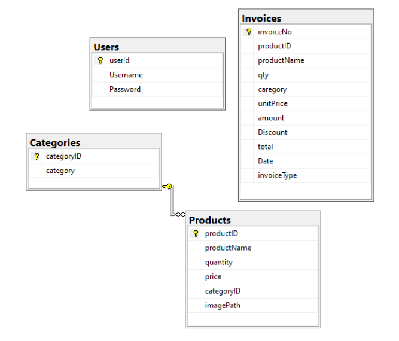
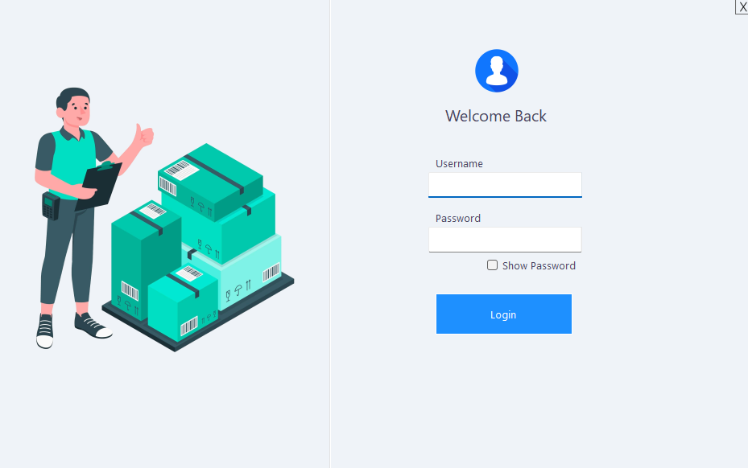

# 📦 Inventory Management System (Windows Forms + SQL Server)

This is a **C# Windows Forms desktop application** developed for a **Database Lab Project**. It serves as a complete Inventory Management System (IMS) integrated with **SQL Server Management Studio (SSMS)**, enabling real-time tracking, secure data handling, and streamlined operations for managing products, categories, and invoices.

---

## 📌 Key Features

- 🔐 **Login Authentication**
  - Only authorized users can access the system.
  - User credentials are verified through the database.
  - Only the database admin can create new users.

- 📊 **Dashboard**
  - Displays real-time data:
    - Total Products
    - Total Categories
    - Total Invoices

- 📂 **Category Management**
  - Add and manage product categories.
  - Clicking a category dynamically displays related products.

- 🛒 **Product Management**
  - Add/delete products with:
    - Image
    - Quantity
    - Price
    - Category
  - Products are displayed as dynamic cards with live data.

- 🧾 **Invoice System**
  - Sale and Return functionality
    - Sale: Deducts from stock and generates invoice card.
    - Return: Adds to stock and generates return invoice card.
  - View invoice records (non-printable).

- 📸 **Image Uploads**
  - Product images are stored and displayed dynamically.

- 🗂️ **Category-Based Sorting**
  - View products filtered by category.

---

## 🛡️ Security Features

### ✅ SQL Injection Protection (Parameterized Queries)

The application uses **parameterized SQL queries** to prevent SQL injection attacks. Instead of directly concatenating user input into SQL statements, all queries are executed safely using parameters.

#### 🔐 Example:
```csharp
SqlCommand cmd = new SqlCommand("SELECT * FROM users WHERE username = @username AND password = @password", conn);
cmd.Parameters.AddWithValue("@username", txtUsername.Text);
cmd.Parameters.AddWithValue("@password", txtPassword.Text);
```
This approach ensures:
🛡️ Malicious inputs cannot alter the SQL command structure
🔐 User inputs are treated strictly as data
⚠️ Protection against unauthorized access and data leaks

## 🛠️ Tech Stack
Language:	C# (.NET Framework)
UI Framework:	Windows Forms 
Database:	Microsoft SQL Server
IDE:	Visual Studio

## 🗃️ Database Schema
Users Table – Stores login credentials
Categories Table – Stores category data
Products Table – Stores product information and images
Invoices Table – Records sales and returns




## 🔗 Relationships:
Products → Foreign key to Categories
Invoices → Foreign key to Products

## 📁 Project Structure
```
IMS-DBMS-Csharp/
├── InventoryManagementSystem
├── .gitignore
├── assets/
│   ├── login-screenshot.png
│   ├── dashboard-screenshot.png
│   └── database-schema.png
├── InventoryManagementSystem.sln
├── README.md
```

## Outputs

> Login Page:



> Dashboard:


---

👨‍💻 Author
Mirza Areeb Baig
Computer Science Student | Database Lab Project

